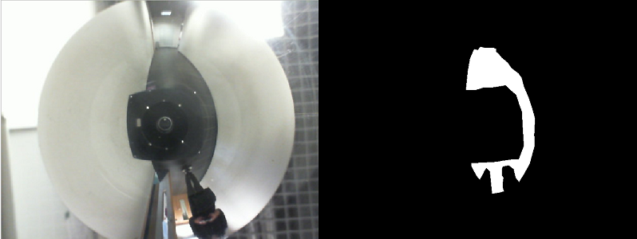

# Neural network navigation with omnidirectional images
I use this repo as a convenient way of storing and describing my progress in completing thesis with my friend.

### Resources available at the beginning:
1. Articles about vision-based navigation and neural networks.
2. Omnidirectional sensor documentation.
3. Existing [LabBot driver](https://github.com/PUTvision/ROS-labbot) for ROS Melodic.

### Roadmap:
1. [Analysis of the articles about navigation based on vision data.](#system-architecture)
2. Choosing system architecture that contains neural network.
3. Preparing dataset and carrying out the learning process. 
4. Implementing this architecture on real robot (Labbot).
5. Documenting experiments and its results.

 ### Technologies I use:
- Google Colab for training neural nets, so I don't have to burn my poor laptop
- CVAT for marking image masks
- Linux (Ubuntu 20.04), simple Bash scripting
- Python and its frameworks and libraries: TensorFlow 2, OpenCV, numpy, [tf-semantic-segmentation](https://github.com/baudcode/tf-semantic-segmentation), [albumentations](https://github.com/albumentations-team/albumentations), [tqdm](https://github.com/tqdm/tqdm)
- ROS Melodic

### LabBot robot

Platform on which the whole structure will be implemented. You can see the omnidirectional sensor at the top.

  

### Choosing system architecture
Thesis is all about navigation and avoiding obstacles, so one of the main tasks is allowing our robot to actually recognize them before doing some avoiding-related stuff. Obstacle detection can be implemented in many ways, such as using typical YOLO or R-CNN detector, however choosing this path generates a huge drawback (which, in my opinion, makes this approach kinda dumb - in my specific case, of course) - such models can recognize only objects that were shown to them during training process. Let's assume, that we put something in front of the working robot, that its model sees this object a very first time. There's possibility, that our robot will simply go straight, it won't care about any unknown stuff and... cause collision.

That's why we've given our attention to a way more universal solution - binary [semantic segmentation](https://www.jeremyjordan.me/semantic-segmentation/).

We're still beginners in machine learning, so we don't want to do some fancy overcomplicated stuff. Main priority is simplicity, therefore we want our neural network to have two classes: free space and everything else.
For semantic segmentation there's a lot of tutorials and repos available, so if someone has well prepared dataset, there's huge probability that even one of many tutorials on youtube will help them to create and train appropiate model. Problem in my case is, that in the aforementioned materials, all the spotlight is stolen by heavy (but also effective) models, like Unet with ResNet or VGG backbone.
System has to be effective and fast, so we can't use such big models, because it would make real time navigation pretty much impossible. We had to focus on architectures that maintain good effectiveness, while being significantly lighter and these options intrigued us:
- PSPNet (with MobileNet of EfficientNet backbone)
- BiSeNet
- DDRNet
- ERFNet

We continued our research (also in terms of ease of implementation for newbies) and stomped on [this](https://github.com/baudcode/tf-semantic-segmentation) library. It provides already configured various models, so we don't have to invent the wheel once again. We decided to use ERFNet model from this repo on our dataset and see where it goes (you can see recent results below).

These articles were kinda helpful. 
1. [Deep Learning based Background Subtraction: A Systematic Survey](https://www.researchgate.net/publication/341049745_Deep_Learning_based_Background_Subtraction_A_Systematic_Survey/link/5f040841299bf1881607d9a5/download)
2. [Where to drive: free space detection with one fisheye camera](https://arxiv.org/abs/2011.05822)

### Preparing dataset (2021-11-02, update below)
Unfortunately, there weren't any public datasets that could be useful for us, so we had to create our own. To make this, we had to carry out a series of recordings from driving LabBot around our laboratory (steering by gamepad) and save camera footage to rosbag files. From this moment there was only dirty work left: watching gathered videos, making screenshots, creating some simple python scripts to trim these images, and using CVAT to mark free space on each of them. So far we have total of 300 images - need to augment them somehow and probably do more recordings as this dataset is still too small.

Sample image (left) and ground truth (right):

  

### Results (2021-11-02, update below)
Details about model that we use are in the code (ipynb file). It is trained on 300 images only, so results are still far from acceptable; however, at this moment I think we can tell, that it's all going in the right direction. 

Image, ground-truth, prediction:

  

  

### Results and dataset update (2021-12-12)
Dataset had been augmented, we increased number of images from 300 to 1100 and we plan to stop at circa 2000. Results are better, I think it could already carry out some basic navigation, however there's still a problem - we keep getting space between tables' and chairs' legs marked as free. This is something we want to avoid and eliminate; labbot can't enter there physically, so it needs to be corrected.

### Navigation
We're in a process of implementing VFH-like algorithm, based on [this](http://www-personal.umich.edu/~johannb/Papers/paper16.pdf) article.
So far I've written a simple algorithm that maps detected free space into bar histogram of ranges from image center. Labbot is going to start from a particular point and will have hardcoded target coordinates. By processing 1) the difference between robot's and said target's position and 2) data about obstacles around our robot from the histogram, a proper direction and speeds will be sent to labbot's encoders. 

### Plans for the future
Testing navigation plans.
